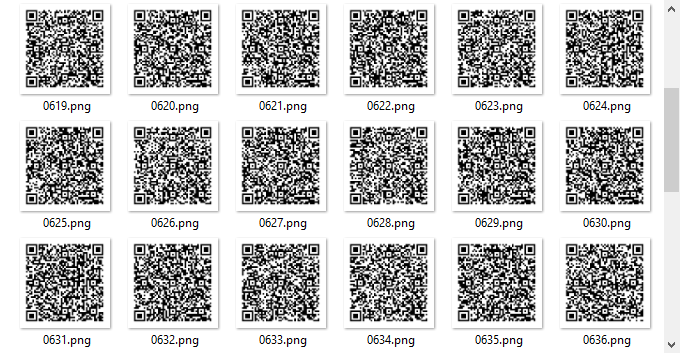
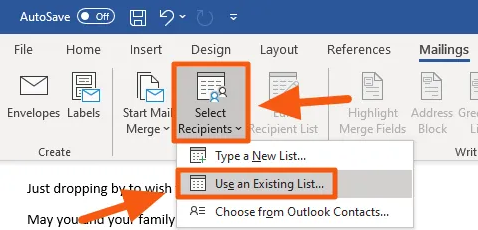
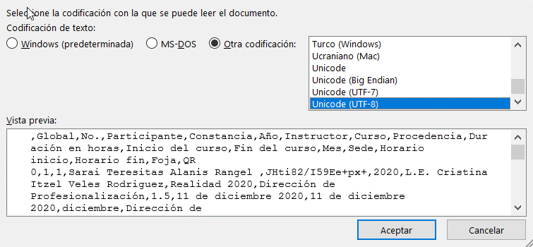
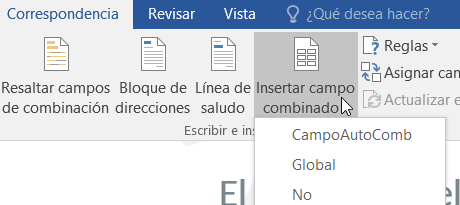
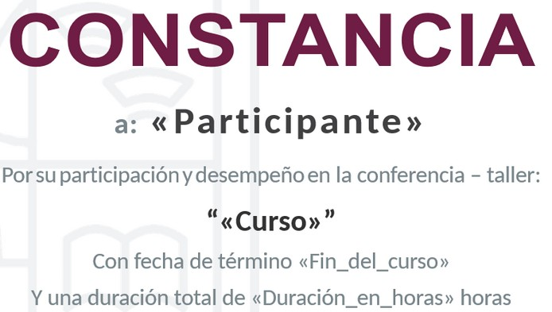
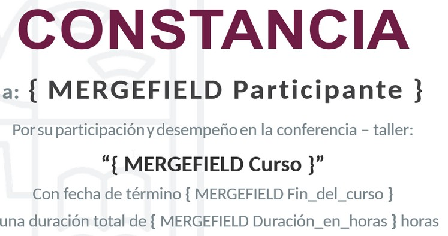
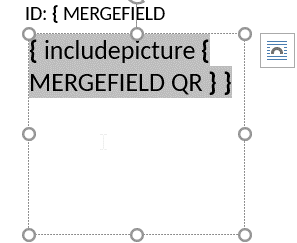
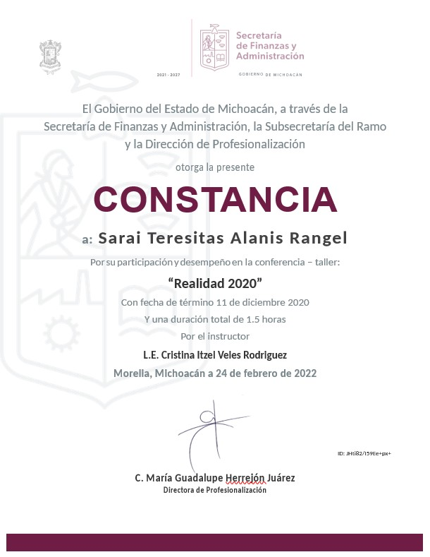
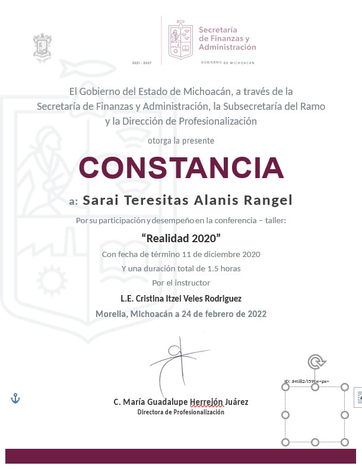
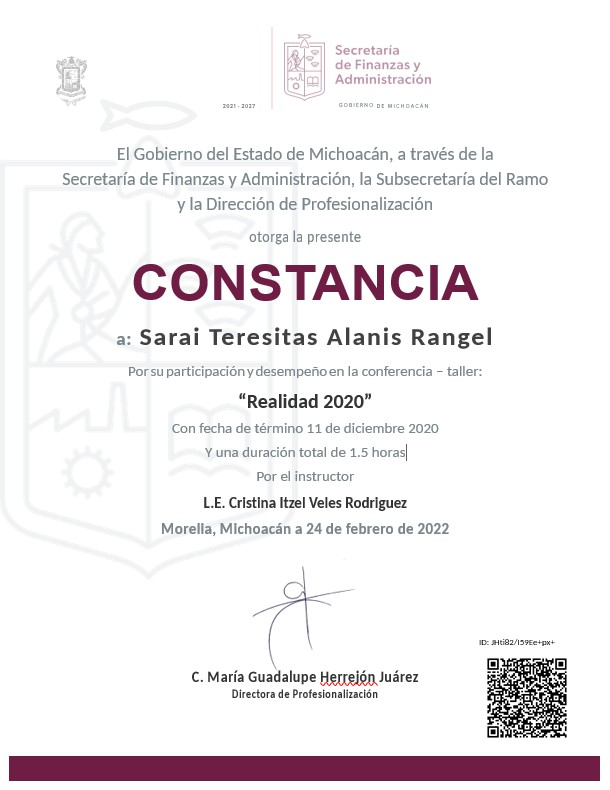

# Digital certificates project

This initiative arose from a delay in the delivery of certificates to workers of the State's Executive Branch who attended courses, workshops, and conferences taught by the Finance and Administration Secretariat. This project defines a partially-automated, scalable process for preparing digital certificates in government agencies that teach those courses.

## Paths reference

- `./template.docx` - The most recent certificate template (editable)

---

- `./data/participants.xlsx` - Participant records
- `./data/participants.csv` - Data export created with: `qrGen.py`

---

- `./pdfs/separate/` - single file for each page in `all.pdf`, filled with: `separatePDFs.sh`
- `./pdfs/all.pdf` - result of mail merge process

---

- `./qrcodes/`- PNG files for each generated QR code, formatted as four character padded digits (eg. 0001.png)

---

- `./src/lib/` - functions and variables available for other scripts
- `./src/wsl/` - initial config scripts for Ubuntu on WSL2
- `./src/organize.py` -> organize certificates by year and instance
- `./src/qrGen.py` -> create CSV file and QR codes
- `./src/renamePDFs.py` -> rename individual PDF files
- `./src/separatePDFs.sh` -> separate the single print of all created certificates (executes `renombrarPDF.py`)

## Software requirements

- [Microsoft Windows](https://www.microsoft.com/en-us/windows)
- [Microsoft Office](https://www.microsoft.com/en-us/microsoft-365/microsoft-office)
- [Ubuntu on WSL2](https://aka.ms/wsl2) (Try the manual install)
- [7-Zip](https://www.7-zip.org/)

## Prep work

1.  Clone project's repository:
    ```sh
    $ git clone https://github.com/jesusrloza/digital-certificates.git
    $ cd digital-certificates
    ```
1.  Be in the correct directory:

    ```sh
    $ cd src
    ```

    Change directory into `src`, you are expected to run all scripts from here.

1.  Perform initial setup:
    ```sh
    $ ./wsl/wsl2-init.sh
    ```

This installs software and sets configurations to create digital certificates.

## Step by step guide

### 1. Place your data

Paste participant's records in the `data` directory as an xlsx file. You may use `participants.example.xlsx` as a guide.

- Expected (required) columns for the code to work as expected:

  | Global | Año | Foja | No. | Curso | Duración en horas | Participante | Constancia | Fin del curso | Instructor |
  | :----: | :-: | :--: | :-: | :---: | :---------------: | :----------: | :--------: | :-----------: | :--------: |
  |        |     |      |     |       |                   |              |            |               |            |

- Expected column headers may be [modified](#changing-variables-to-fit-different-needs) to fit different office's needs.

### 2. Create QR codes for each row in the records:

```sh
$ ./qrGen.py
```

First, this script validates a correct environment with all the necessary files and directories. Then it reads each row in the data to define a name and an encoded string for the resulting qr codes. Finally it uses the `qrencode` program to create the file and fill the `./qrcodes/` directory.

The result looks like this:


Each file holds encoded text similar to the following:

> ° Dirección de Profesionalización, SFA Michoacán 2021 | Foja 16 - Educación Alimentaria Laboral (2 horas) | Participante: Jesús Antonio Ramírez Loza | ID: XyzpgOObHTrQScH0

### 3. Mail merge

1.  Load participants data

    First open the `template.docx` file and go to:

    > Mailings (tab). Select recipients. Use an Existing List.

    

    Select `participants.csv` and make sure that it's read in `UTF-8` encoding.

    

1.  Inserting merged fields

    We can select:

    > Insert merge field

    These fields will be updated with the data of each row from the csv.

    

    Pressing `<Alt>+F9` toggles between two ways of displaying the fields
    to insert. If you don't plainly see a field, try toggling the display to be sure it is there. Especially useful to see if the QR code field is set correctly.

    

    

1.  Insert a text box and the QR code field

    1. Insert a text box at the desired place in the document.
    1. Put your cursor in the text box and press `<Ctrl>+F9`.

       This inserts an empty field between two square brackets `{}`.

    1. Type the instruction `includepicture`, leave a space and then insert the `QR` field.

       Not part of Excel but added to the CSV file, it holds an absolute path from local drive (`C:`) pointing to each PNG file.

    

    ```
    { includepicture { MERGEFIELD QR } }
    ```

    Note that the size of the qr code may vary slightly depending on the encoded text and that it extends down and to the right.

1.  Finish & Merge

    Once the merged fields are in place we can select:

    > Mailings (tab). Finish & Merge. Edit Individual Documents.

    This opens a new window for the word processor with all certificates as an editable document.

1.  Update QR code field

    The QR codes are not immediately visible, you have to click inside the text box and refresh the field with the `F9` key.

    This is the only non-automated procedure, it is strongly recommended to adjust the zoom of the application so that each page fills the screen. This way you can alternate between pressing the `F9` to update the field and `PgDown`, working through hundreds of records in a few minutes.

    Lastly, validate that there is not a blank sheet at the end of the new document and delete it if necessary.

    
    
    

1.  Export and save

    The file should be exported as PDF in:

    > `./pdfs/all.pdf`

### 4. Separate PDFs

```sh
$ ./separatePDFs.sh
```

This takes `./pdfs/all.pdf` and places each page into the `./pdfs/separate` directory, giving them meaningful names to help with data storage and archive.

Each filename should contain information about the global record number, the year, the course instance and the registration number of the participant. it looks like this:

> < 'Global' 4 digits >\_C< year >F< 'instance' 3 digits >R< 'No.' 3 digits >.pdf>

> eg. 0700_C2020F072R004.pdf

### 5. Archive storage

```sh
$ ./organize.py
```

In case the user is working with certificates of multiple years, this script will help organize them in directories for each year and instance by prompting the user to enter:

- a starting year: year of the oldest certificate
- an ending year: year of the newest certificate
- an instance amount: number of the most instances that were taught in any given year

The script will create directories for each year and instance, simultaneously moving individual certificates into the correct place. Any directory without a corresponding certificate will remain empty. For this reason, it's recommended to **overshot the instance amount** and delete empty directories after.

Here's an example for a period of five years with a max of two courses, workshops, or conferences per year:

```sh
jesusrloza@ubuntu:src$ ./organizePDFs.py
Start year: 2016
End year: 2020
Max instance amount: 2

jesusrloza@ubuntu:src$ cd ../pdfs/separate

jesusrloza@ubuntu:separate$ tree -L 2
.
├── Año_2016
│   ├── Foja_001
│   └── Foja_002
├── Año_2017
│   ├── Foja_001
│   └── Foja_002
├── Año_2018
│   ├── Foja_001
│   └── Foja_002
├── Año_2019
│   ├── Foja_001
│   └── Foja_002
└── Año_2020
    ├── Foja_001
    └── Foja_002
```

> All certificates are stored inside their corresponding instance and year directory.

To remove any empty directory you can run this command:

```sh
$ find ../pdfs/separate -type d -empty -delete
```

### 6. Data compression

The recommended software for compression and archiving of the `pdfs/separate` certificates is `7-zip`, a free and open-source software available on windows, mac and linux.

```sh
winget install 7zip.7zip
```

## Changing variables to fit different needs

In `./src/organizePDFs.py` you may change:

- Default names for year and instance directories

In `./src/qrGen.py` you may change:

- QR codes: names and encoded text

In `./src/renamePDFs.py` you may change:

- Naming convention for individual certificates

In `./src/lib/env.py` you may change:

- Path names
- Required columns
